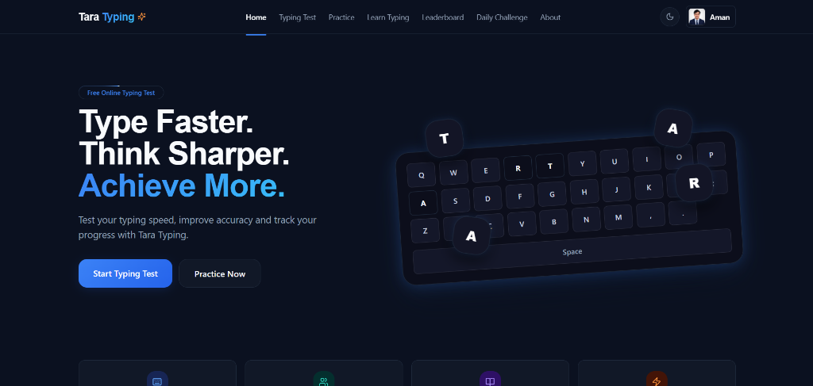
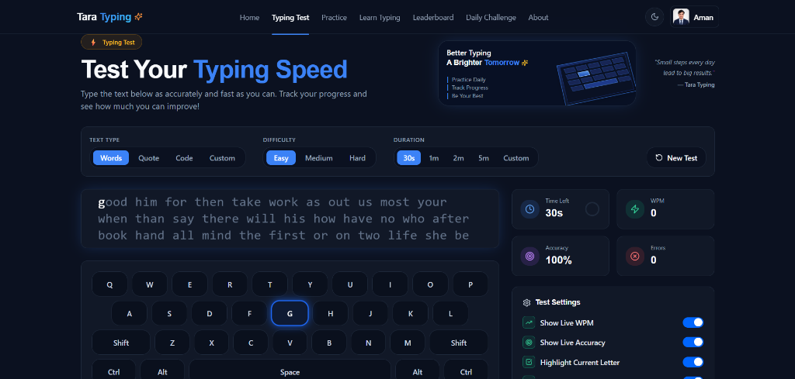
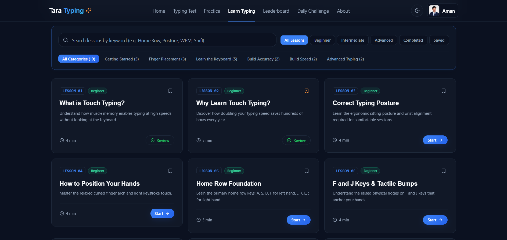
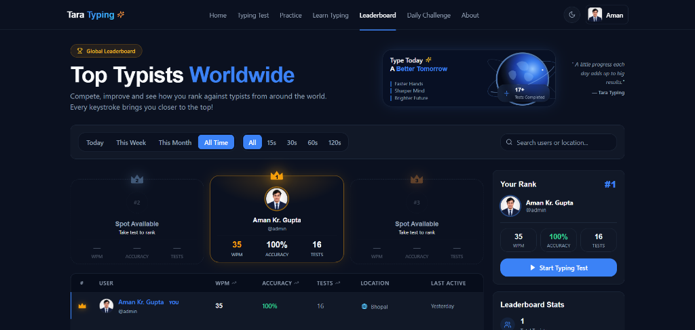
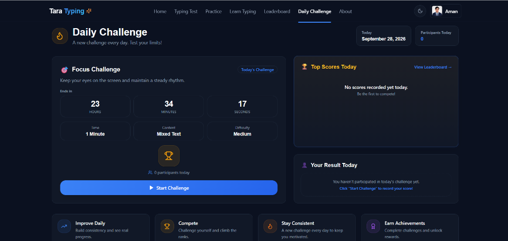
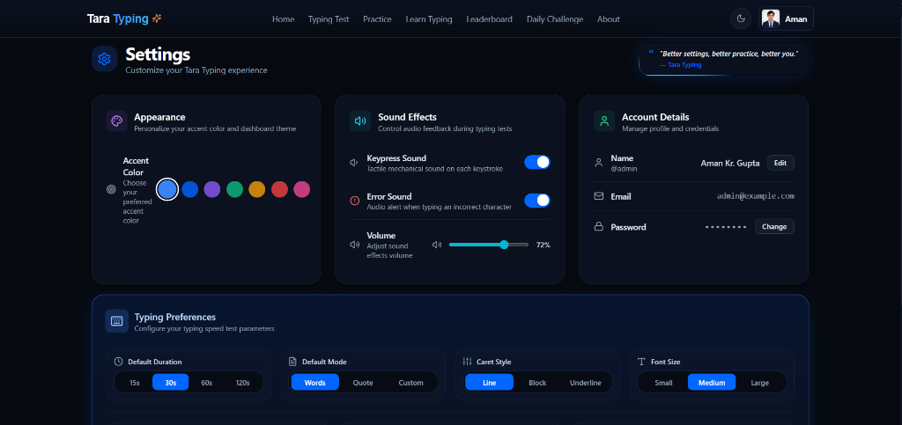
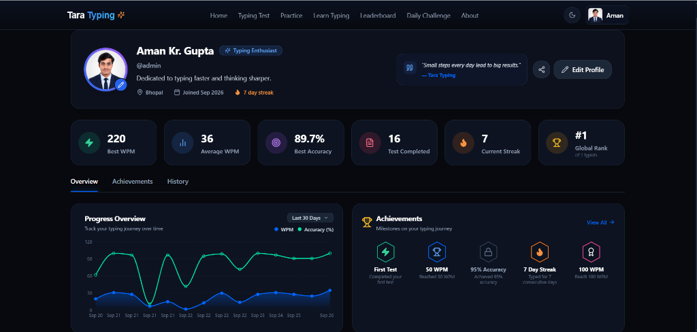
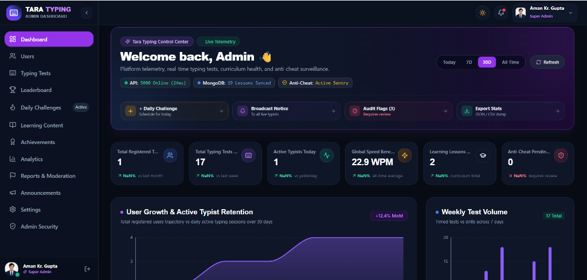
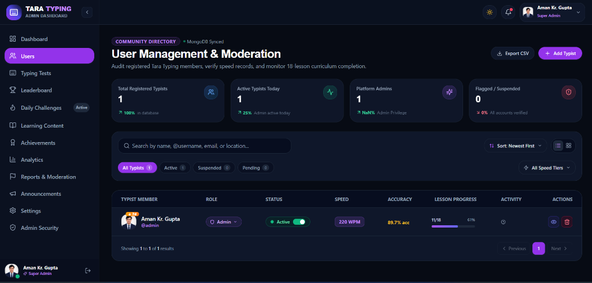
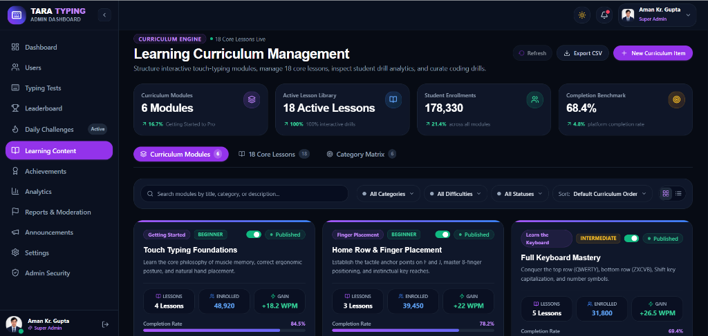

# ⚡ Tara Typing — Modern Touch Typing & AI Coaching Platform

<div align="center">

> *"Type Faster. Think Sharper. Master Touch Typing with Real-Time Precision & AI Coaching."*

[](https://reactjs.org/)
[](https://vitejs.dev/)
[](https://tailwindcss.com/)
[](https://nodejs.org/)
[](https://expressjs.com/)
[](https://socket.io/)
[](https://www.mongodb.com/)
[](LICENSE)

A sleek, enterprise-grade, full-stack MERN typing platform featuring instant keystroke evaluation, an interactive virtual keyboard, zero-latency mechanical switch acoustics, 19+ structured lessons, real-time multiplayer racing, an AI Typing Coach (ChatGPT mode), downloadable certificates, and a complete admin telemetry suite.

</div>

---

## 📸 Screenshots & UI Showcase

### 🌐 Public Typist & Learner Interface

| 🏠 Landing Page & Hero | ⚡ Live Typing Test & Virtual Keyboard |
| :---: | :---: |
|  |  |

| 📚 Touch Typing Curriculum (19+ Lessons) | 🏆 100% Responsive Leaderboard |
| :---: | :---: |
|  |  |

| 🏎️ Multiplayer Typing Race | 🤖 Tara AI Typing Coach (ChatGPT Mode) |
| :---: | :---: |
| *Real-time racing with bots & friends* | *Date-grouped history, pin, & file analyzer* |

| 🔥 Synchronized Daily Challenge | 📜 Official Completion Certificate |
| :---: | :---: |
|  | *Downloadable & verifiable achievement badge* |

| ⚙️ Custom Preferences, Themes & Audio | 👤 Typist Profile & Speed Analytics |
| :---: | :---: |
|  |  |

<br/>

### 🛠️ Admin Suite (`/admin`)

| 📊 Telemetry & Control Center | 👥 User Management & Active/Suspend Guard |
| :---: | :---: |
|  |  |

| 📖 Touch Typing Curriculum Management Engine | 📢 Announcements & System Broadcasts |
| :---: | :---: |
|  | *Global maintenance notices & system alerts* |

---

## ✨ Key Features

### ⚡ 1. High-Precision Typing Engine
- **Instant Keystroke Analysis**: Calculates Net WPM, Raw WPM, Accuracy %, Consistency, and Error breakdown on every keystroke with zero UI latency.
- **Synchronized Virtual Keyboard**: 5-row interactive QWERTY visual guide with real-time keypress lighting and touch-typing finger color placement.
- **Tactile Audio Synthesis**: Zero-latency mechanical switch acoustics (Thock, Typewriter, Clicky, Beep) synthesized natively using the Web Audio API.

### 🤖 2. Tara AI Typing Coach (ChatGPT Mode)
- **Conversational AI Coaching**: Break through speed plateaus (60/80/100+ WPM), correct bad backspace habits, and master number & symbol rows.
- **ChatGPT-Style Experience**:
  - ➕ **New Chat**: Instant fresh discussions.
  - 🕒 **Past Chat History**: Date-wise grouping (Today, Yesterday, Previous 7 Days, Older) with live keyword search and clear-all functionality.
  - 📌 **Pin Important Chats**: Pin drill advice to the top of your history.
  - 📎 **File & Document Reader**: Attach `.txt`, `.js`, `.py`, `.json`, `.csv`, `.md` files to generate custom practice drills or analyze source code.
  - 💻 **Syntax-Highlighted Code Blocks**: Code blocks formatted with language tags and 1-click clipboard copy.
  - ⛶ **Adaptive Viewport**: Fullscreen expansion, floating minimize pill, pinned header, and flush bottom input capsule.

### 🏎️ 3. Multiplayer Real-Time Typing Race (`/race`)
- **Live Multiplayer Competition**: Compete with real typists and AI racers (Turbo Turtle, Speedy Rabbit, Cyber Cheetah) in synchronized live races powered by Socket.io.
- **Race Track Visualizer**: Animated vehicle progression tracking progress, current WPM, and live track positions.
- **Custom Race Topics**: Race on custom quotes, tech documentation, literature passages, or AI-generated prompts.

### 📜 4. Official Completion Certificate (`/certificate`)
- **Verifiable Achievement**: Generate a downloadable and printable certificate of completion featuring your peak WPM, accuracy, date, and unique certificate ID.

### 📚 5. Touch Typing Curriculum (19+ Lessons)
- Structured lessons from Home Row (`ASDF JKL;`) to top row, bottom row, numbers, punctuation, and advanced coding syntax drills.

### 🏆 6. Global Leaderboards & Daily Challenge
- **Responsive Leaderboard**: Olympic podium (Gold, Silver, Bronze) with sortable filters across daily, weekly, and all-time records.
- **Synchronized Daily Challenge**: Fresh test passage released every 24 hours with a synchronized global countdown clock.

### 🛡️ 7. Enterprise Admin Governance Suite
- Full telemetry dashboard, user active/suspend status control, curriculum lesson creator, analytics graphs, and announcement management.

---

## 🛠️ Tech Stack

| Area | Technologies |
|---|---|
| **Frontend** | React 18, Vite 5, Tailwind CSS 3, Framer Motion, Lucide Icons, Canvas Confetti |
| **Real-Time Race** | Socket.io Client & Server |
| **Charts & Audio** | Recharts (Speed/Accuracy Progression), Web Audio API (Synthesized Mechanical Switches) |
| **Backend** | Node.js, Express.js REST API |
| **Database** | MongoDB with Mongoose 8 ODM |
| **Auth & Security** | JWT (HTTP-Only Secure Cookies), Argon2 Password Hashing, Express Rate Limiter, Helmet |
| **Media Storage** | Cloudinary & Multer (Avatar Uploads) |

---

## 📁 Project Structure

```
Tara-Typing/
├── client/                      # React 18 + Vite + Tailwind CSS Frontend
│   ├── src/
│   │   ├── components/
│   │   │   ├── admin/           # Admin governance & telemetry components
│   │   │   ├── chat/            # TypingChatbot (Tara AI Coach & ChatGPT Mode)
│   │   │   ├── common/          # ProtectedRoute, PageTransition, Navbar, Footer
│   │   │   ├── layout/          # Main application layout wrapper
│   │   │   ├── race/            # Real-time multiplayer race track & modals
│   │   │   └── typing/          # TypingEngine, VirtualKeyboard, StatsDisplay
│   │   ├── context/             # Auth, Chatbot, Settings, Theme, Learn, Typing
│   │   ├── hooks/               # useTypingEngine, useSoundEngine
│   │   ├── pages/               # Home, TypingTest, Race, Learn, Leaderboard, Certificate, About
│   │   └── utils/               # Audio synth, calculations, text generators
│   └── package.json
├── server/                      # Node.js + Express + MongoDB REST API & Socket.io
│   ├── src/
│   │   ├── controllers/         # Auth, typing, profile, race, leaderboard, admin
│   │   ├── models/              # User, TypingResult, Course, Lesson, Race schemas
│   │   ├── routes/              # Express API endpoints
│   │   ├── middleware/          # JWT auth guard, admin guard, rate limiter
│   │   ├── sockets/             # Socket.io multiplayer race handler
│   │   └── seeds/               # Database admin seed script
│   └── package.json
├── screenshots/                 # Application visual previews & screenshots
└── README.md
```

---

## 🚀 Quick Start Guide

### 1. Prerequisites
- **Node.js** (v18+)
- **MongoDB** (Local instance or MongoDB Atlas URI)

---

### 2. Backend Setup
```bash
cd server
npm install
```

Create a `server/.env` file:
```env
PORT=5000
CLIENT_URL=http://localhost:5173
MONGODB_URI=mongodb://localhost:27017/tara_typing
JWT_SECRET=your_super_secret_jwt_key
CLOUDINARY_CLOUD_NAME=your_cloud_name
CLOUDINARY_API_KEY=your_api_key
CLOUDINARY_API_SECRET=your_api_secret
```

Seed the default administrator account:
```bash
npm run seed
# Default Admin: admin@taratyping.com | Password: Admin@12345
```

Start the backend server:
```bash
npm run dev
# Backend running at http://localhost:5000
```

---

### 3. Frontend Setup
```bash
cd ../client
npm install
npm run dev
# Frontend running at http://localhost:5173
```

---

### 4. Production Build
```bash
# Build Client
cd client
npm run build

# Preview Production Build
npm run preview
```

---

## 👥 Authors & License

- **Lead Developer**: Aman Kumar Gupta ([@aman-gupt1](https://github.com/aman-gupt1))
- **Repository**: [aman-gupt1/tara-typing](https://github.com/aman-gupt1/tara-typing)
- **License**: [MIT License](LICENSE)
